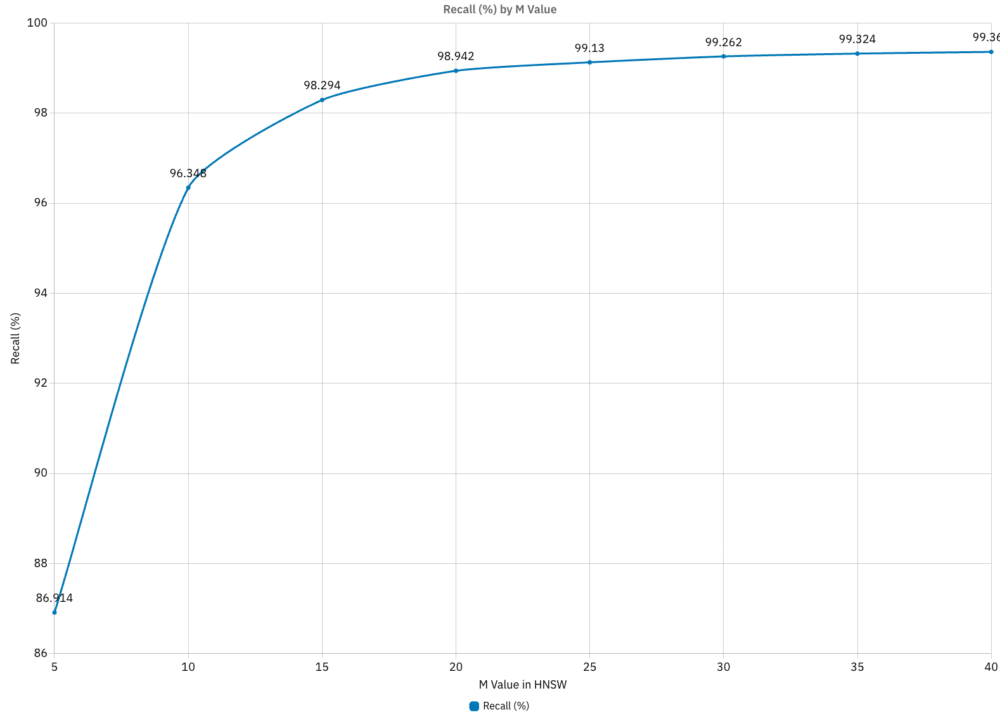
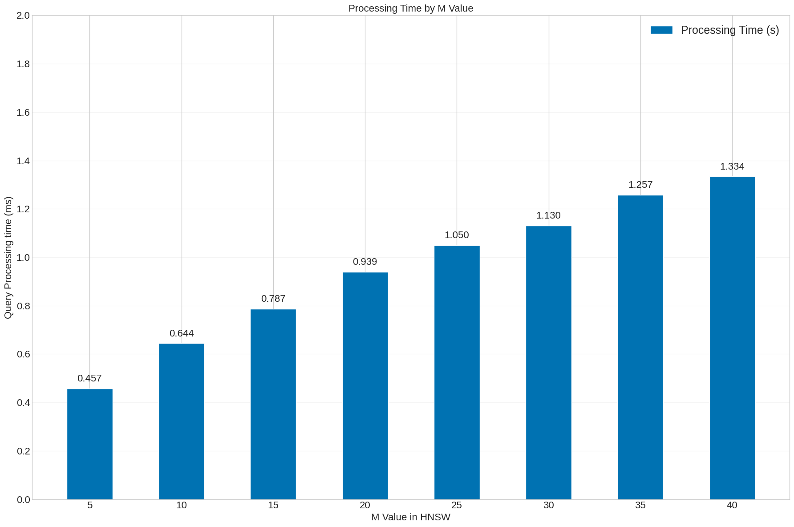

# HNSW-Lite

[](https://pypi.org/project/hnsw-lite/)
[](https://pypi.org/project/hnsw-lite/)
[](https://github.com/chandb5/hnsw-lite/blob/main/LICENSE)
[](https://pypi.org/project/hnsw-lite/)

A lightweight, pure Python implementation of Hierarchical Navigable Small World (HNSW) algorithm for approximate nearest neighbor search.

## Overview

HNSW-Lite provides an efficient solution for approximate nearest neighbor search in high-dimensional spaces. It's designed to be lightweight, easy to use, and suitable for a wide range of applications including:

- Similarity search in vector databases
- Recommendation systems
- Image similarity
- Document retrieval
- Feature matching

The implementation follows the algorithm described in ["Efficient and robust approximate nearest neighbor search using Hierarchical Navigable Small World graphs"](https://arxiv.org/abs/1603.09320) by Malkov & Yashunin (2016).

## Key Features

- **Pure Python Implementation**: No C/C++ dependencies required
- **Multiple Distance Metrics**: Supports cosine and euclidean distance
- **Simple API**: Easy to integrate into your projects
- **Metadata Support**: Attach arbitrary metadata to vectors
- **Flexible Configuration**: Tune parameters for speed/accuracy tradeoffs

## Installation

```bash
pip install hnsw-lite
```

## Quick Start

```python
import numpy as np
from hnsw.hnsw import HNSW

# Initialize HNSW index
hnsw = HNSW(space="cosine", M=16, ef_construction=200)

# Sample vectors to index
vectors = [
    [1.0, 0.0, 0.0],
    [0.0, 1.0, 0.0],
    [0.0, 0.0, 1.0],
    [0.5, 0.5, 0.0],
    [0.3, 0.3, 0.3]
]

# Add vectors to the index with optional metadata
for i, vector in enumerate(vectors):
    hnsw.insert(vector, {"id": i, "description": f"Vector {i}"})

# Create a query vector
from hnsw.node import Node
query_vector = [0.3, 0.3, 0.3]
query_node = Node(query_vector, 0)

# Search for nearest neighbors
k = 3  # Number of nearest neighbors to retrieve
results = hnsw.knn_search(query_node, k)

# Process results
for i, (distance, node) in enumerate(results):
    print(f"Neighbor {i+1}:")
    print(f"  Distance: {-distance}")  # Distances are negated in results
    print(f"  Vector: {node.vector}")
    print(f"  Metadata: {node.metadata}")
```

## API Reference

### HNSW Class

The main class for creating and searching the HNSW index.

```python
HNSW(space="cosine", M=16, ef_construction=200)
```

#### Parameters

- `space` (str): Distance metric to use. Options: "cosine", "euclidean". Default: "cosine"
- `M` (int): Maximum number of connections per node (except for layer 0). Default: 16
- `ef_construction` (int): Size of the dynamic list for the nearest neighbors during construction. Higher values lead to more accurate graphs but slower construction. Default: 200

#### Methods

- `insert(vector, metadata={})`: Insert a vector into the index with optional metadata
- `knn_search(query_node, top_n)`: Find k nearest neighbors for a query

### Node Class

Used to represent vectors in the HNSW graph.

```python
Node(vector, level, metadata=None)
```

#### Parameters

- `vector` (List[float]): The vector to be stored in the node
- `level` (int): The level of the node in the HNSW hierarchy
- `metadata` (Dict): Optional metadata to associate with the node

## Performance Benchmarks

### Effect of M Parameter on Recall and Performance

The M parameter (maximum number of connections per node) is crucial for balancing search accuracy and performance. Our benchmarks show:

#### Recall vs M Value



As shown in the graph:
- M=5: 86.91% recall 
- M=10: 96.34% recall 
- M=15: 98.29% recall 
- M=20: 98.94% recall 
- M=30: 99.26% recall 
- M=40: 99.36% recall 

The biggest improvements occur when increasing M from 5 to 15. After M=20, the recall gains diminish significantly while computational costs continue to increase.

#### Query Processing Time vs M Value



Processing time increases with higher M values:
- M=5: 0.457 ms
- M=10: 0.644 ms 
- M=15: 0.787 ms 
- M=20: 0.939 ms 
- M=30: 1.130 ms 
- M=40: 1.334 ms 

### Comparison with Other Algorithms


When comparing HNSW-Lite with other algorithms (FAISS, MRPT) on the SIFT dataset:
- HNSW consistently delivers sub-2ms query times regardless of dataset size
- HNSW shows faster query times compared to traditional methods 
- Performance remains stable across different dataset sizes, from 50,000 to 500,000 records

### Recommended M Values for Different Use Cases

| Use Case | Recommended M | Rationale |
|----------|---------------|-----------|
| Ultra-fast search with acceptable recall | 8-12 | Good balance for speed-critical applications |
| Balanced performance | 15-20 | Best trade-off between recall and speed for most applications |
| High recall priority | 25-35 | When search quality is more important than speed |
| Maximum recall | 40+ | When search accuracy is critical, regardless of speed |

## Parameter Tuning

### Tuning the M Parameter

The HNSW algorithm's performance can be significantly impacted by the choice of M value:

- **Lower M values (5-12)**: 
  - ✅ Faster index construction
  - ✅ Lower memory usage
  - ✅ Faster queries
  - ❌ Lower recall/accuracy

- **Higher M values (20-40)**:
  - ✅ Better recall/accuracy (diminishing returns after M=20)
  - ❌ Slower index construction
  - ❌ Higher memory usage
  - ❌ Slower queries

**Suggested approach for tuning M:**
1. Start with M=10 (good default value)
2. If search quality is insufficient, increase to M=20 or M=30
3. If search is too slow, decrease to M=8 or M=6
4. Run benchmarks with your specific dataset to find the optimal value

### Tuning ef_construction

- **Lower ef_construction values (50-100)**: 
  - ✅ Faster index construction
  - ❌ Potentially lower quality graph

- **Higher ef_construction values (200-500)**:
  - ✅ Better graph quality
  - ❌ Slower index construction

For most use cases, ef_construction=200 provides a good balance.

## Performance Considerations

- **Memory Usage**: Each vector requires storage for its coordinates, connections, and metadata
- **Construction Time**: Scales roughly as O(n log n), where n is the number of vectors
- **Search Time**: Scales approximately logarithmically with the number of vectors
- **Optimal M Value**: The best M value depends on your specific use case, dataset dimensionality, and performance requirements

## Limitations

- This is a pure Python implementation optimized for ease of use and understanding rather than maximum performance
- For extremely large datasets (millions of vectors), you might want to consider C++ implementations like [hnswlib](https://github.com/nmslib/hnswlib)

## Contributing

Contributions are welcome! Please feel free to submit a Pull Request.

## License

This project is licensed under the MIT License - see the LICENSE file for details.

## Citation

If you use HNSW-Lite in your research, please cite the original HNSW paper:

```
@article{malkov2016efficient,
  title={Efficient and robust approximate nearest neighbor search using hierarchical navigable small world graphs},
  author={Malkov, Yury A and Yashunin, Dmitry A},
  journal={IEEE transactions on pattern analysis and machine intelligence},
  volume={42},
  number={4},
  pages={824--836},
  year={2018},
  publisher={IEEE}
}
```